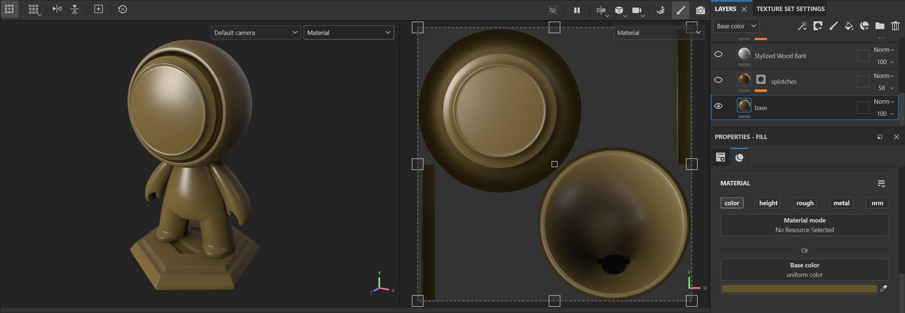
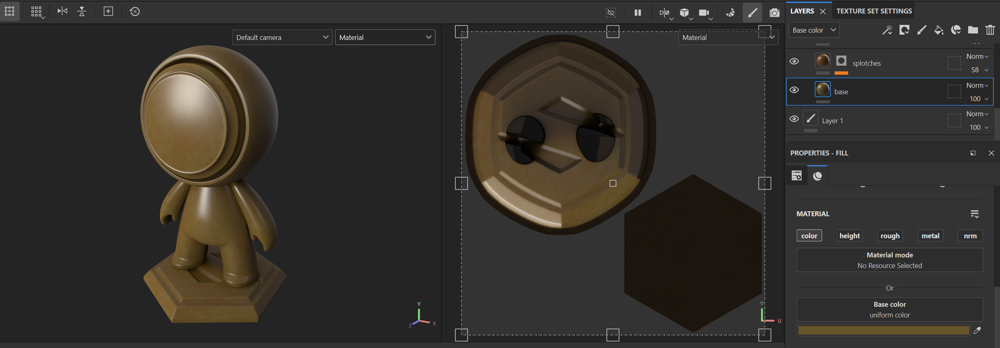
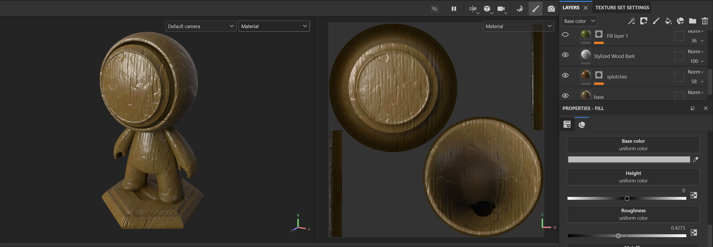
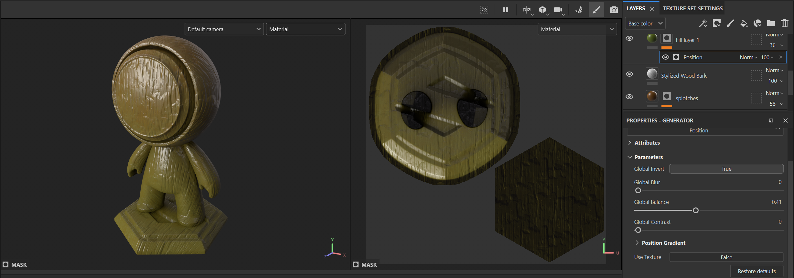
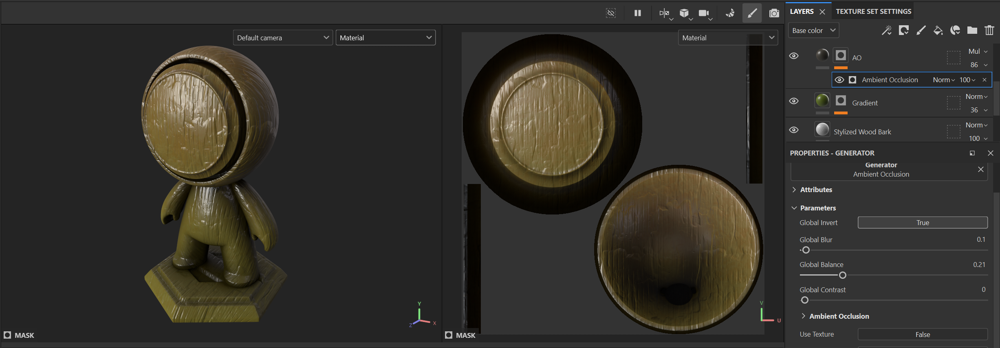
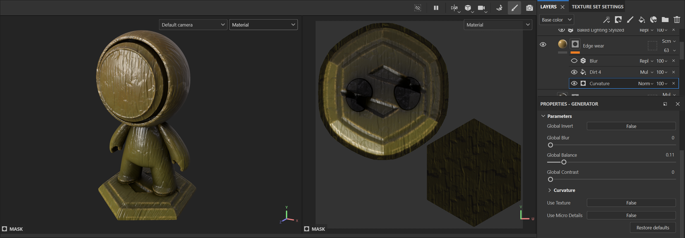
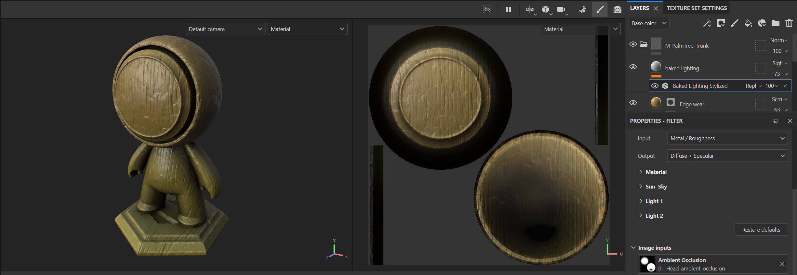

# Lab - Smart Materials Creation in Substance Painter

*In this lab, we will create a **stylized palm tree trunk** material using Substance Painter. By the end, you will understand smart materials, layer masks, generators, filters, and blending modes. These techniques can be used for a host of different stylized or realistic surfaces*

### Introduction

Smart materials in Substance Painter allow for dynamic, reusable materials using layers, masks, and procedural effects. In this lab, we will build a detailed texture for the **trunk** of a stylized palm tree.

This material will showcase Substance Painter's capabilities using baked input textures (e.g., curvature, ambient occlusion, thickness), library assets like grunge and noise maps, and dynamic blending. We will use **generators**, **filters**, and **masks** to add wear, depth, and stylistic detail, resulting in a striking trunk texture. The lab doesn't cover baking as these processes may change in future updates, or you may complete your bakes in other tools.

The lab encourages creative experimentation while maintaining a procedural workflow.

---

### Core Concepts

#### **1. Layers and Layer Types**

Substance Painter's layers control channels like **Base Color**, **Roughness**, **Metallic**, and **Normal**.

- **Fill Layers**: Apply textures or colors uniformly.
- **Paint Layers**: Add hand-painted details.
- **Mask Layers**: Blend or isolate parts of a material.

---

#### **2. Masks and Masking Techniques**

Masks define where materials or effects are applied.

- **Black/White Masks**: White reveals, black conceals.
- **Generator Masks**: Driven by baked maps (e.g., curvature, AO).
- **Custom Masks**: Hand-painted or imported for specific effects.

---

#### **3. Input Maps from Baking**

Baked textures drive procedural effects, including:

- **Curvature**: Highlights edges and ridges for wear effects.
- **Ambient Occlusion (AO)**: Shadows in crevices.
- **Position**: Spatial orientation of the object.
- **Thickness**: Identifies thin or hollow areas for unique effects.

---

#### **4. Generators and Filters**

Generators and filters create dynamic effects.

- **Edge Wear Generator**: Adds wear based on curvature.
- **Dirt Generator**: Uses AO and grunge maps for organic overlays.
- **Grunge and Noise Maps**: Add variation.
- **Filters**: Blur, sharpen, or stylize layer effects.

---

#### **5. Blending Modes and Opacity**

Blending modes control how layers interact.

- **Multiply**, **Overlay**, and **Screen**: Add depth and variation.
- **Opacity Adjustments**: Control transparency and integration of effects.

---

#### **6. Library Assets**

Substance Painter's library provides various assets:

- **Grunge Maps**: Add wear and variation.
- **Noise Maps**: Enhance texture.
- **Brushes**: Manual detail and masking.
- **Alpha Maps**: Patterns for stamping or masking.

---

### Goals for This Lab

By the end of this lab, you will:

1. Create a base color layer for the trunk
2. Add color variation with painterly splotches
3. Incorporate wood grain ridges using masks and height adjustments
4. Use the position map to create gradient effects
5. Utilize the ambient occlusion map to add shadows in recesses
6. Apply stylized edge wear using curvature and grunge maps
7. Add baked lighting to simulate stylized light and shadow effects
8. Organize and save all the layers as a reusable smart material

---

### Section 1 - Creating the Base Layer for the Trunk Material

#### **Layer 1 - Base Colour**

Create the foundational base color for the palm tree trunk.

1. **Add a Fill Layer**
   - Click **Add Fill Layer** in the Layers panel.

2. **Set the Base Color**
   - In **Properties**, set **Base Color** to **rich brown**.

3. **Disable Other Channels**
   - Turn off **Roughness**, **Metallic**, and **Normal** to affect only **Base Color**.

> *N.B - This base layer provides the consistent tone for the trunk texture.*

---

### Section 2 - Adding Stylized Color Variation with Painterly Splotches

#### **Layer 2 - Painterly Splotches for Color Variation**

Add a stylized, painterly effect to break up the uniform base color.

1. **Add a New Fill Layer**
   - Click **Add Fill Layer** in the Layers panel.

2. **Set the Base Color**
   - Set **Base Color** to a slightly different **brown**.

3. **Apply a Noise Texture as a Mask**
   - Right-click the Fill Layer, select **Add Black Mask**.
   - In **Properties**, **Add Effect** > **Fill**, and select a **splotchy noise texture**.

4. **Add Blur to the Mask**
   - Right-click the mask, **Add Filter** > **Blur**.
   - Adjust **Blur Intensity** for a softer, more organic look.

5. **Adjust Tiling**
   - Set **Tiling** for mid-frequency variation. Avoid small, high-frequency details.

6. **Repeat with Multiple Shades**
   - **Duplicate** the layer, adjust **Base Color** and **mask properties** to add richness.

> *N.B - Layering shades creates a painterly effect that adds visual depth.*

---

### Section 3 - Creating Stylized Wood Grain Ridges

#### **Layer 3 - Stylized Wood Grain Ridges**

Create stylized wood grain ridges to add visual depth and normal map detail.

1. **Add a New Fill Layer**
   - Click **Add Fill Layer**.

2. **Add a Wood Grain Texture**
   - Add **Black Mask** to the Fill Layer.
   - **Add Effect** > **Fill** and select a **wood grain texture**.

3. **Adjust Tiling**
   - Set **Tiling** for natural, mid-frequency detail.

4. **Blur the Mask**
   - **Add Filter** > **Blur**, adjust for a stylized look.

5. **Set Base Color**
   - Set to a **darker brown** for simulated ambient occlusion.

6. **Activate Height Channel**
   - Enable **Height** adjust **Balance and Contrast for subtle texture.**

7. **Adjust Blending Mode**
   - Set **Blending Mode** to **Multiply** for depth. Adjust **Opacity** as needed.

> *N.B - Combining color and height details enhances texture depth.*

---

### Section 4 - Adding Position-Based Gradient for Stylization

#### **Layer 4 - Position Gradient for Stylized Effects**

Apply a gradient using the baked position map to add artistic shading.

1. **Add a New Fill Layer**
   - Click **Add Fill Layer**.

2. **Add a Black Mask**
   - Right-click, select **Add Black Mask**.

3. **Add Generator to the Mask**
   - **Add Effect** > **Generator**, select **Position**.

4. **Adjust Gradient**
   - Tweak **Properties** to control gradient direction and intensity.

5. **Set Base Color**
   - Use a **blue or purple** to add stylized cool tones or **green** for moss.

6. **Adjust Blending Mode and Opacity**
   - Set **Blending Mode** to **Overlay** or **Multiply**. Adjust **Opacity** for balance.

> *N.B - Position gradients can add environmental or artistic shading.*

---

### Section 5 - Adding Ambient Occlusion for Depth

#### **Layer 5 - Ambient Occlusion for Enhanced Depth**

Use the baked AO map to add shadows in recessed areas for realism.

1. **Add a New Fill Layer**
   - Click **Add Fill Layer**.

2. **Add a Black Mask**
   - Right-click, select **Add Black Mask**.

3. **Add Generator to the Mask**
   - **Add Effect** > **Generator**, select **Ambient Occlusion**.

4. **Set Base Color**
   - Set to a **darker brown** for shadowing.

5. **Adjust Blending Mode and Opacity**
   - Set **Blending Mode** to **Multiply**. Adjust **Opacity** as needed.

> *N.B - AO enhances depth and realism in shaded areas.*

---

### Section 6 - Adding Stylized Edge Wear

#### **Layer 6 - Stylized Edge Wear**

Add stylized edge wear to the trunk to emphasize edges and create natural wear.

1. **Add a New Fill Layer**
   - Click **Add Fill Layer** to create a new layer on top of the previous ones.

2. **Add a Black Mask**
   - Right-click the Fill Layer and select **Add Black Mask**.

3. **Add a Curvature Generator**
   - With the mask selected, **Add Effect** > **Generator**, then choose **Curvature** to highlight the edges of the model.

4. **Disrupt the Mask with Grunge and Noise**
   - Add a **Fill Effect** to the mask, and select a **Grunge Map** or **Noise Map** to add irregularities.
   - Adjust **Tiling** and **Balance** for a natural, varied look.

5. **Set Base Color**
   - Set **Base Color** to a **lighter, less saturated brown** to simulate edge wear.

6. **Activate Height Channel**
   - Enable the **Height** channel and adjust **Height Intensity** to add subtle variation along worn edges.

7. **Adjust Blending Mode and Opacity**
   - Set **Blending Mode** to **Overlay** or **Screen** to blend naturally. Adjust **Opacity** for subtle integration.

> *N.B - Adding grunge and noise to the edge wear mask ensures a more natural, believable look.*

---

### Section 7 - Adding Baked Lighting for Stylized Enhancement

#### **Layer 7 - Baked Lighting Effect**

Adding baked lighting can enhance the appearance of stylized assets, especially for games with limited lighting. This layer will introduce baked lighting to emphasize surface details and add depth.

1. **Add a New Fill Layer**
   - Click **Add Fill Layer** to create a new procedural layer.

2. **Add Stylized Lighting Filter**
   - With the new Fill Layer selected, click **Add Effect** > **Filter**.
   - Choose **Stylized Lighting** from the list of filters.

3. **Set Light Parameters**
   - In the **Properties** panel, set the lighting parameters to have **neutral tones** (no hue or saturation) to avoid mismatched lighting warmth or coolness between assets.

4. **Adjust Blending Mode and Opacity**
   - Set the **Blending Mode** to **Soft Light** to blend the baked lighting effect with the material naturally.
   - Adjust **Opacity** to achieve the desired lighting intensity without overpowering other effects.

> *N.B - Baked lighting adds depth and visual interest, especially in assets for stylized environments with minimal in-game lighting.*

---

### Section 8 - Saving the Smart Material

#### **Final Step - Organize and Save as a Smart Material**

To wrap up, we will organize all the layers and save them as a reusable smart material.

1. **Group All Layers**
   - Select all the layers in the Layers panel.
   - Right-click on the selected layers and choose **Create Folder** to group them.
   - Name the folder appropriately, such as **Palm Tree Trunk Material**.

2. **Save as a Smart Material**
   - Right-click on the newly created folder and select **Create Smart Material**.
   - This will save your grouped layers as a **Smart Material**, which you can reuse for other parts of the palm tree or future projects.

> *N.B - Saving your material as a Smart Material ensures consistency across similar assets and saves time when creating multiple stylized elements.*

